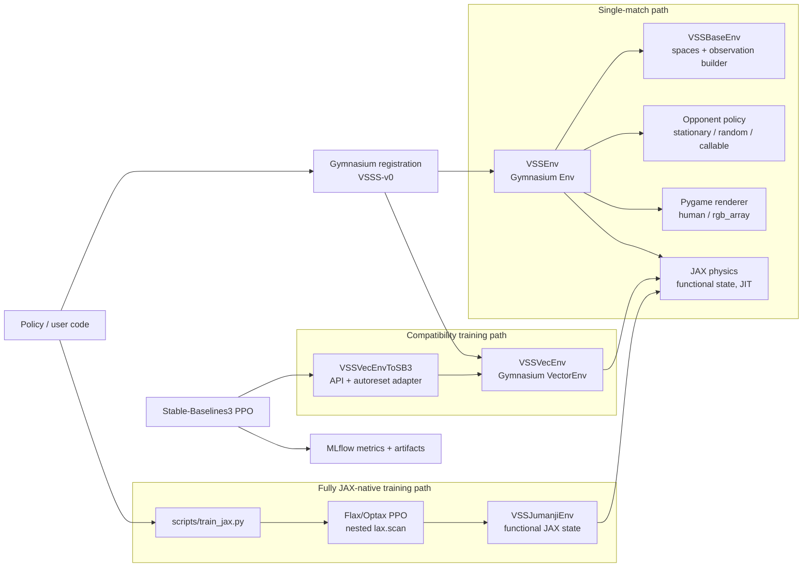
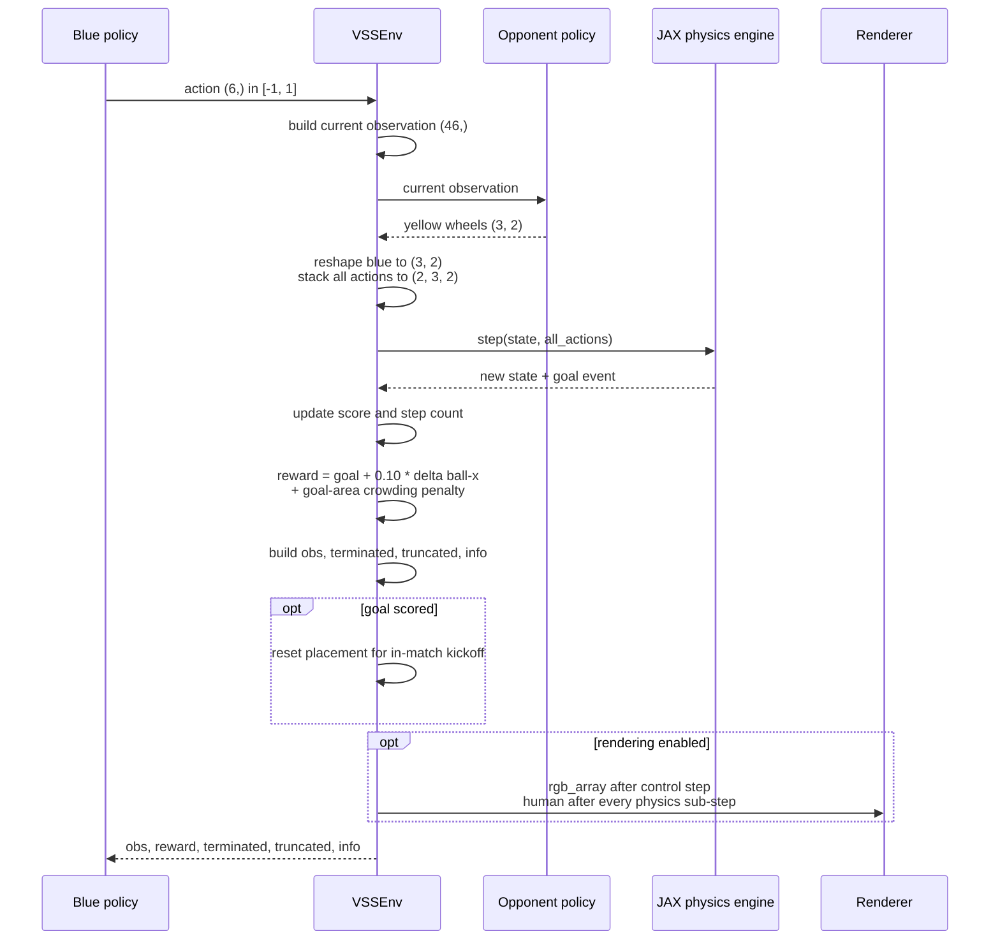
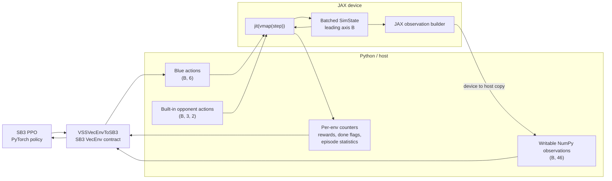
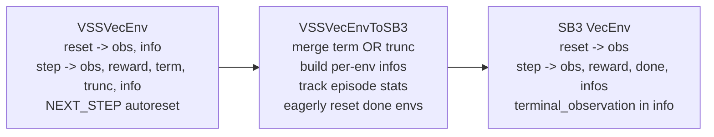
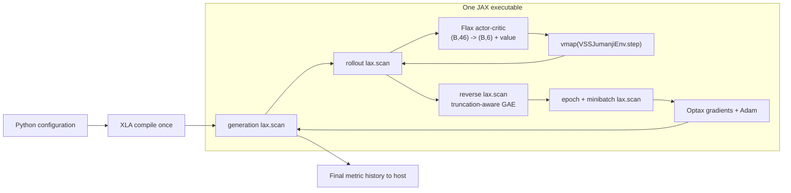
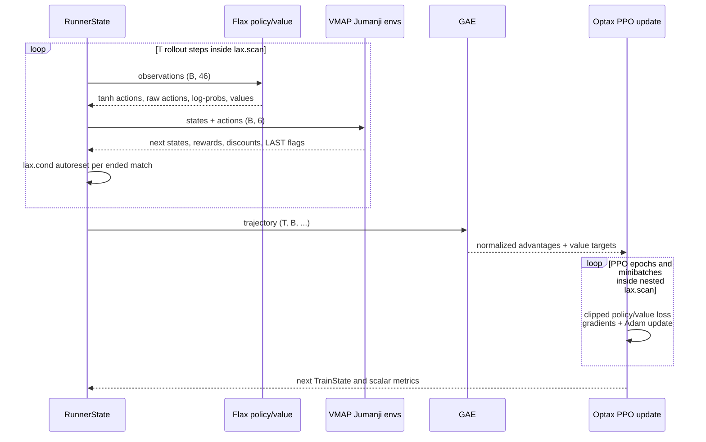
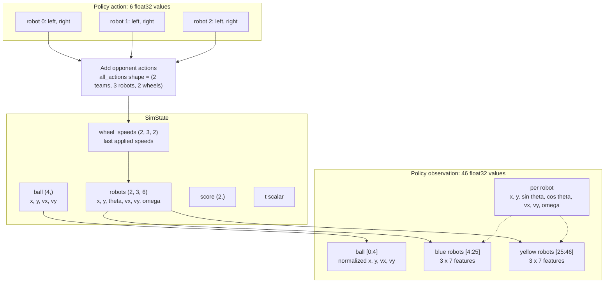
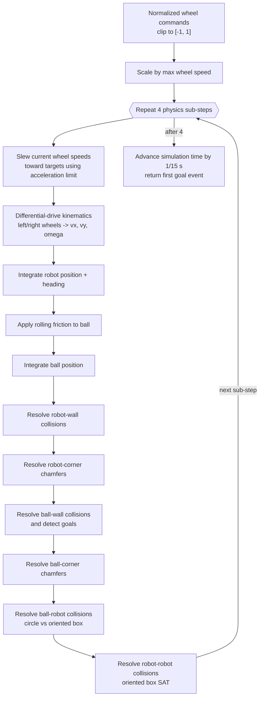
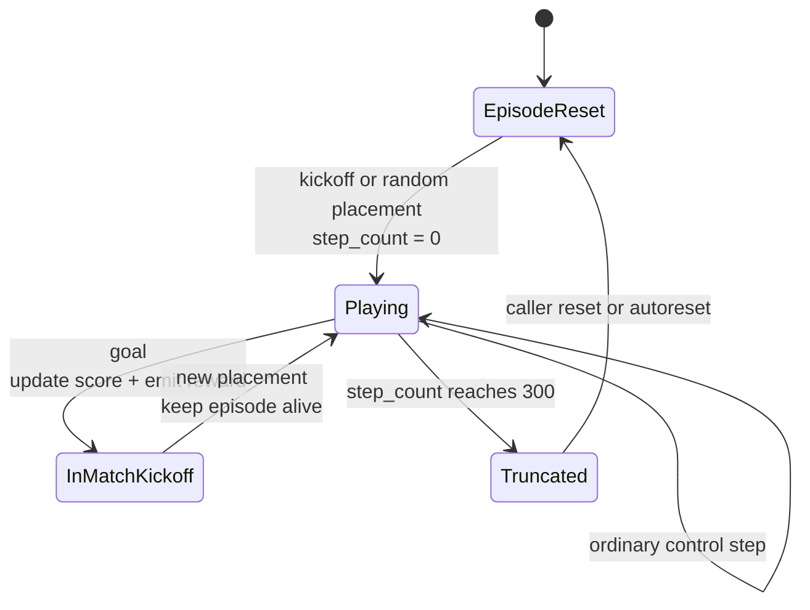
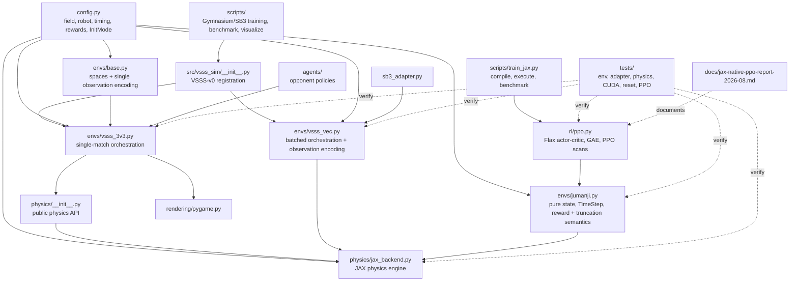

# Simulator structure

This document is a visual map of the simulator as it exists today. Read it top-to-bottom
for progressively more detail: public entry points, one environment step, both batched training
paths, data shapes, physics, and reset semantics.

> This is **IEEE VSSS 3v3**: six differential-drive robots, two wheel commands per robot,
> no kicker or dribbler, and a walled 150 x 130 cm field.

## 1. System map

The simulator exposes three paths over shared physics: a flexible single-match Gymnasium path,
a Gymnasium/SB3 compatibility path, and a fully JAX-native PPO path. The native path uses a
functional Jumanji contract so complete rollouts and optimizer generations can be compiled.

All three paths share the same functional JAX physics step. `VSSVecEnv` batches it with `vmap`
and compiles the result with `jit`. `VSSJumanjiEnv` represents one pure match; PPO applies
`vmap` for the environment batch and keeps the policy, rollout, GAE, gradients, and optimizer
state on the JAX device.

## 2. One control step in `VSSEnv`

The controlled policy only commands blue. The environment obtains yellow's commands from the
configured opponent, combines both teams, advances physics, and turns the result into the RL
transition.

`terminated` is always false: a match has no absorbing mid-episode state. The time limit sets
`truncated`; goals update the score and trigger a kickoff without ending the episode.

## 3. Batched PPO data paths

### Gymnasium/SB3 compatibility path

The batched design keeps simulation state on the JAX device, but SB3/PyTorch consumes NumPy
arrays on the host. That boundary explains both the large physics speedup and the remaining
end-to-end overhead.

Built-in stationary and random opponents are assembled as batches. A custom callable receives
one observation at a time through a Python loop, so it is intentionally the slow path.

The adapter exists because Gymnasium and SB3 use different vector-environment contracts:

### Fully JAX-native path

The native path removes the per-step Python framework boundary. One compiled executable owns
the policy, environment batch, rollout buffer, advantage calculation, and optimizer updates.

The Gymnasium path remains useful for SB3 compatibility, rendering-adjacent workflows, and
external RL libraries. The Jumanji path is the high-throughput training implementation.

## 4. One fully compiled PPO generation

With the defaults, one generation collects `B x T = 256 x 128 = 32768` transitions and then
performs four PPO epochs over eight minibatches. The shapes remain static, allowing XLA to
compile the entire sequence.

Time-limit truncation has two signals: `discount=1` bootstraps the value from the final
observation, while `LAST` stops GAE recursion before the reset episode. Goals are not terminal;
they update the score and trigger an in-match kickoff.

## 5. Data model and RL interface

The physics state is richer than the policy observation. Wheel speeds, score, and time remain
internal; positions and velocities are normalized into one flat policy vector.

For `VSSVecEnv`, every state and interface shape above gains a leading batch dimension `B`.
For native PPO, `jax.vmap` adds that dimension to `VSSJumanjiEnv.State`, while `lax.scan` adds
the rollout dimension `T` to stored transitions.

## 6. Physics step: 15 Hz control, 4 sub-steps

A policy selects target wheel speeds once per 1/15-second control step. The physics engine
splits that interval into four smaller steps for smoother acceleration and more reliable
collision handling.

State is an immutable float32 `NamedTuple` PyTree. `step` returns a new state, uses
`lax.fori_loop` for substeps, and can be transformed directly with `jax.jit` and `jax.vmap`.

## 7. Match and reset lifecycle

There are two different resets: a goal creates a new kickoff *inside* the same match, while the
time limit ends the episode and causes a full reset.

`InitMode.KICKOFF` uses the standard formation with jitter. `InitMode.RANDOM` samples the ball
and all robots across the field with random headings; overlaps are allowed and left for physics
to resolve.

### Current implementation boundaries

These details matter when comparing trajectories across execution paths:

- `VSSEnv` supports rendering; `VSSVecEnv` currently does not.
- Human rendering advances and draws each physics sub-step. Non-human stepping runs one engine
  call for the whole control step.
- Reset helpers return a fresh state whose score and simulation time are zero. The single-env
  in-match kickoff therefore resets those fields; the Jumanji path explicitly preserves them.
- Physics resolves the field's 45-degree corner chamfers for both robots and the ball.
- On a goal, single `VSSEnv` builds the returned observation before its kickoff reset. Batched
  `VSSVecEnv` performs the kickoff before exporting the returned observation.
- The single path calculates goal-area crowding from the post-physics state. On a goal, the
  batched path performs its kickoff first and then calculates crowding from the new placement.
- Gymnasium vector mode uses next-step autoreset after truncation. The SB3 adapter changes this
  to eager autoreset and preserves the terminal observation in `info`.
- `VSSJumanjiEnv` is functional and renderer-free. Its built-in stationary and random opponents
  stay in JAX; arbitrary Python opponent callables are intentionally unsupported in this path.
- The Jumanji goal kickoff explicitly preserves match score and simulation time. Native PPO
  autoresets ended episodes through `lax.cond` and bootstraps timeout values from the final
  observation before replacing it with the reset observation.

## 8. Source map

